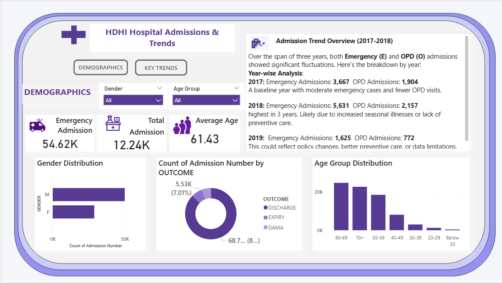

# Power BI Dashboard: Hospital Admissions & Trends

> 📊 A self-initiated Power BI case study focused on healthcare analytics.

## Overview
This self-initiated Power BI project analyses hospital admission patterns,
focusing on emergency vs OPD admissions, patient demographics, treatment outcomes,
and key medical conditions. The dashboard is designed to support data-driven
healthcare planning and resource allocation.

## Key Insights
- Emergency admissions significantly exceed OPD admissions and drive overall hospital workload
- Admission volumes peaked in 2018, indicating potential seasonal or systemic stress
- Majority of patients fall within the 50–69 age group, highlighting the need for geriatric-focused care
- Discharges dominate outcomes, while DAMA cases suggest accessibility or affordability challenges
- Chronic conditions such as hypertension and diabetes are consistently prevalent
- Length of stay increases toward year-end, indicating seasonal healthcare demand

## Dashboard Features
- Yearly and monthly admission trend analysis
- Emergency vs OPD admission comparison
- Demographic segmentation by age group and gender
- Treatment outcome and diagnosis breakdowns
- Interactive slicers, bookmarks, and themed filters

## Tools Used
- Power BI
- Microsoft Excel

## Data Disclaimer
The dataset used in this project is anonymised or simulated and is intended
for demonstration purposes only.

## Dashboard Preview

